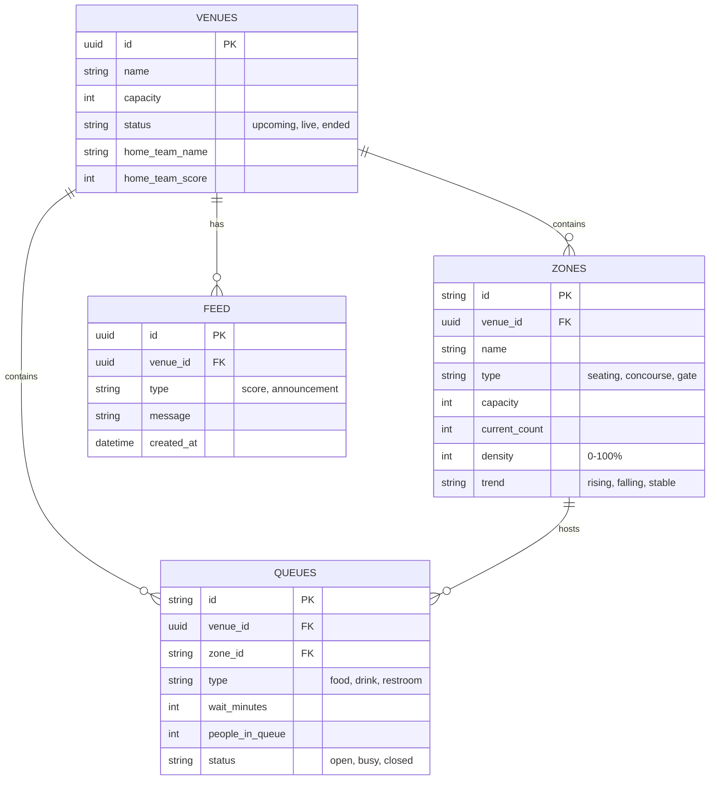

# VenueFlow Data Model

This document outlines the core data model and architecture used in the VenueFlow system. The data model is designed to support both static venue infrastructure (capacities, locations) and highly dynamic real-time metrics (crowd density, wait times).

The system uses a **PostgreSQL** relational database (via Supabase) with the following schema.

---

## Entity Relationship Diagram (ERD)



---

## 1. Venues Table
The root entity representing the physical stadium and the current state of the live event.

| Column | Type | Description | Example |
| :--- | :--- | :--- | :--- |
| `id` | `UUID` (PK) | Unique identifier | `a1b2c...` |
| `name` | `TEXT` | Venue name | `MetLife Grand Stadium` |
| `sport` | `TEXT` | Primary sport being played | `Football` |
| `capacity` | `INTEGER` | Total maximum capacity | `52000` |
| `status` | `TEXT` | Match status (upcoming, live, ended) | `live` |
| `home_team_name` | `TEXT` | Full name of home team | `Thunder FC` |
| `home_team_score`| `INTEGER` | Current home score | `2` |
| `match_clock` | `TEXT` | Live game clock | `42:15` |
| `weather_temp` | `INTEGER` | Live weather temperature | `24` |

---

## 2. Zones Table
Represents physical sections of the stadium (Gates, Concourses, Seating stands). 
*This table is highly dynamic and updated constantly as crowds move.*

| Column | Type | Description | Example |
| :--- | :--- | :--- | :--- |
| `id` | `TEXT` (PK) | Unique identifier | `zone-north` |
| `venue_id` | `UUID` (FK) | Reference to Venues | `a1b2c...` |
| `name` | `TEXT` | Display name | `North Stand` |
| `type` | `TEXT` | Category of zone | `seating`, `concourse`, `gate` |
| `capacity` | `INTEGER` | Max safe occupancy | `8000` |
| `current_count`| `INTEGER` | **[LIVE]** Actual people in zone | `4800` |
| `density` | `INTEGER` | **[LIVE]** Heatmap percentage (0-100) | `60` |
| `trend` | `TEXT` | **[LIVE]** Movement vector | `rising`, `falling` |
| `pos_x`, `pos_y` | `INTEGER` | Coordinates for SVG Map rendering | `50, 10` |

---

## 3. Queues Table
Represents individual service points like food stands, merch tents, and restrooms.

| Column | Type | Description | Example |
| :--- | :--- | :--- | :--- |
| `id` | `TEXT` (PK) | Unique identifier | `q-food-1` |
| `zone_id` | `TEXT` (FK) | The zone this queue is located in | `zone-concourse-n` |
| `name` | `TEXT` | Display name | `Burger & Fries Stand` |
| `type` | `TEXT` | Category of queue | `food`, `drink`, `restroom` |
| `wait_minutes` | `INTEGER` | **[LIVE]** Est. wait time | `8` |
| `people_in_queue`| `INTEGER` | **[LIVE]** Physical queue length | `24` |
| `status` | `TEXT` | Operational status | `open`, `busy`, `closed` |
| `icon` | `TEXT` | UI marker icon | `🍔` |

---

## 4. Feed Table
An append-only log of events broadcasted to the fans.

| Column | Type | Description | Example |
| :--- | :--- | :--- | :--- |
| `id` | `UUID` (PK) | Unique identifier | `f7d8e...` |
| `venue_id` | `UUID` (FK) | Reference to Venues | `a1b2c...` |
| `type` | `TEXT` | Category of update | `announcement`, `score` |
| `title` | `TEXT` | Short headline | `⚡ GOAL!` |
| `message` | `TEXT` | Body of the update | `Thunder FC scores!` |
| `severity` | `TEXT` | UI Color hint | `info`, `warning`, `critical`|
| `created_at` | `TIMESTAMPTZ`| When it happened | `2026-05-24T12:00:00Z`|

---

## Real-Time Architecture (WebSocket Payloads)

While the data above lives in PostgreSQL, changes are pushed instantly to clients via WebSockets (`Socket.IO`). The frontend does not need to refresh or poll the database.

**Example: `zone:update` Payload**
When 50 people enter the North Stand, the system emits:
```json
{
  "event": "zone:update",
  "data": {
    "id": "zone-north",
    "current_count": 4850,
    "density": 61,
    "trend": "rising"
  }
}
```

**Example: `queue:update` Payload**
When a food line gets backed up, the system emits:
```json
{
  "event": "queue:update",
  "data": {
    "id": "q-food-1",
    "wait_minutes": 15,
    "people_in_queue": 45,
    "status": "busy"
  }
}
```
